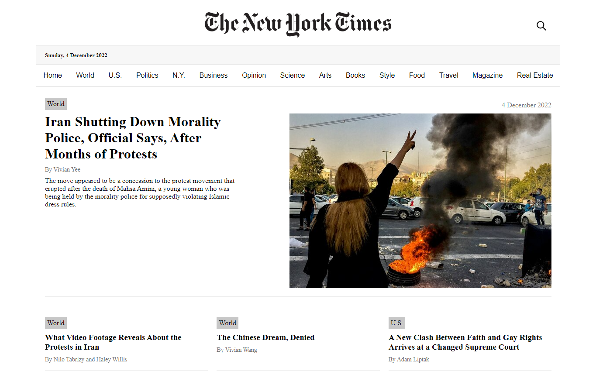
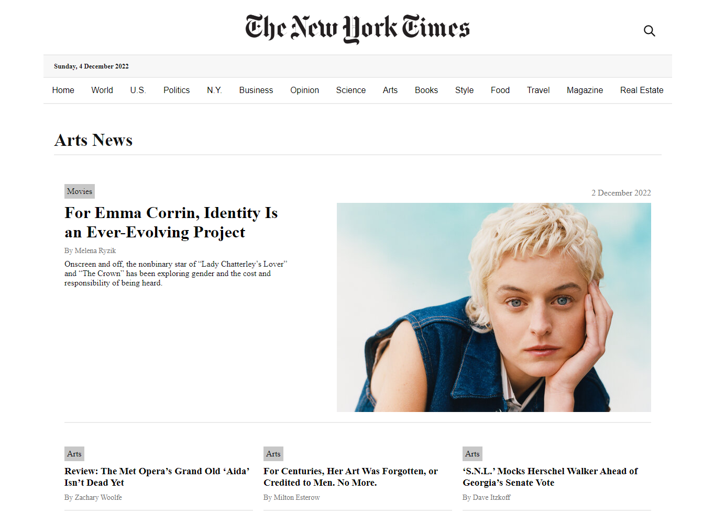

# New York Times Clone

New York Times Clone built with React.

This is the final project from the React course on the online course provider [Start2Impact](https://www.start2impact.it/), where I'm studying front-end development.

## Link

[Project URL](https://new-york-times-clone-react.netlify.app/) (hosted on Netlify)

## Screenshot

 
 

## Project

Users should be able to:

- View the optimal layout for the content depending on their device’s screen size
- See the homepage with the current top stories
- Select a section from the navigation menu and see the top stories related to that topic
- In the mobile and tablet versions, tap the menu icon to open the menu and the X icon to close it
- In the desktop version, click on the magnifying glass icon to see the search input
- Search for a topic and see a list of news related to the keyword entered
- Sort the results of the search by relevance (default), newest or oldest

## Built with

- Semantic HTML5 markup
- CSS custom properties and media queries
- [CSS Modules](https://github.com/css-modules/css-modules)
- JavaScript
- React
- [Create React App](https://create-react-app.dev/)
- [React Router](https://reactrouter.com/en/main)
- [New York Times API](https://developer.nytimes.com/)
- [axios](https://axios-http.com/)
- [React Spinners](https://www.npmjs.com/package/react-spinners)
- [classnames](https://www.npmjs.com/package/classnames)

## Author

Chiara Stefanelli - Front-End Development Student based in Italy

- Website - [Chiara Stefanelli](https://chiarastefanelli.netlify.app/)
- LinkedIn - [Chiara Stefanelli](https://www.linkedin.com/in/chiarastefanelli/?locale=en_US)
- start2impact profile - [Chiara Stefanelli](https://talent.start2impact.it/profile/chiara-stefanelli-13)
